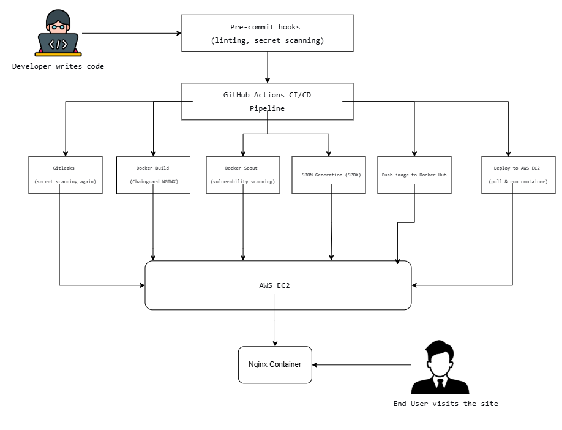

# 🚀 DevSecOps NGINX Pipeline with Terraform, Docker Scout & SBOM

> A production-inspired DevSecOps project demonstrating Infrastructure as Code, secure containerization, automated security scanning, SBOM generation, and continuous deployment to AWS.


---

# 📌 Project Overview

Modern DevOps is no longer just about deploying applications quickly—it is about delivering software **securely, consistently, and automatically**.

This project showcases a complete **DevSecOps pipeline** where every code change is automatically validated, scanned for secrets, analyzed for vulnerabilities, documented with an SBOM, published to Docker Hub, and deployed to AWS.

The application itself is a lightweight static website served from a **Chainguard Distroless NGINX** container to minimize the attack surface.

This project demonstrates practical skills in:

- Infrastructure as Code
- Secure containerization
- CI/CD automation
- Supply chain security
- Cloud deployment
- Security-first software delivery

---

# 🎯 Objectives

This project was built to demonstrate how to:

- Provision AWS infrastructure using Terraform
- Containerize an application with Docker
- Use a hardened Chainguard NGINX image
- Detect secrets before deployment
- Scan container images for vulnerabilities
- Generate an SPDX Software Bill of Materials (SBOM)
- Automatically publish Docker images
- Automatically deploy containers to AWS EC2
- Follow DevSecOps best practices throughout the software lifecycle

---

# 🏗️ Solution Architecture


## CI/CD Flow

```text
Developer
    │
    ▼
Pre-Commit Hooks
    │
    ├── Trailing Whitespace Check
    ├── YAML Validation
    ├── Private Key Detection
    └── Gitleaks Secret Scan
    │
    ▼
Git Push
    │
    ▼
GitHub Repository
    │
    ▼
GitHub Actions
    │
    ├── Secret Scanning
    ├── Docker Build
    ├── Docker Scout Scan
    ├── SBOM Generation
    ├── Docker Hub Push
    └── AWS Deployment
    │
    ▼
AWS EC2
    │
    ▼
NGINX Container
    │
    ▼
Users
```

---

## AWS Infrastructure


```

---

# 🛠 Technology Stack

| Category | Technology |
|-----------|------------|
| Frontend | HTML5, CSS3 |
| Containerization | Docker |
| Base Image | Chainguard Distroless NGINX |
| Infrastructure | Terraform |
| Cloud | AWS EC2, VPC, Security Groups |
| CI/CD | GitHub Actions |
| Security | Gitleaks, Docker Scout |
| Supply Chain | SPDX SBOM |
| Registry | Docker Hub |

---

# 🔐 Security Implementation

Security is integrated into every stage of the delivery pipeline.

## Secret Detection

Before every commit, pre-commit hooks execute:

- Gitleaks
- Detect Private Key
- YAML validation
- End-of-file fixes
- Trailing whitespace cleanup

The pipeline immediately fails if any secrets are discovered.

---

## Hardened Container Image

Instead of the standard NGINX image, this project uses the **Chainguard Distroless NGINX** image.

Benefits include:

- No package manager
- No shell
- Minimal dependencies
- Smaller image size
- Reduced attack surface

---

## Vulnerability Scanning

Docker Scout scans every container image.

The pipeline automatically fails when:

- Critical vulnerabilities exist
- High severity vulnerabilities exist

This prevents insecure images from reaching production.

---

## Software Bill of Materials (SBOM)

An SPDX SBOM is generated during every build.

Benefits:

- Dependency transparency
- Supply chain visibility
- Easier vulnerability management
- Compliance readiness

The SBOM is uploaded as a GitHub Actions artifact.

---

## Infrastructure Security

Infrastructure is provisioned using Terraform with:

- Custom VPC
- Public subnet
- Internet Gateway
- Security Group
- Elastic IP
- Least required inbound ports

---

# 📂 Project Structure

```text
devsecops-nginx/

├── .github/
│   └── workflows/
│       └── pipeline.yml
│
├── terraform/
│   ├── provider.tf
│   ├── variables.tf
│   ├── outputs.tf
│   ├── main.tf
│   ├── userdata.sh
│   └── terraform.tfvars
│
├── assets/
│
├── Dockerfile
├── docker-compose.yml
├── index.html
├── styles.css
├── .pre-commit-config.yaml
├── .gitignore
└── README.md
```

---

# 🚀 Running the Project Locally

## Clone the Repository

```bash
git clone https://github.com/oshiokefred-collab/devsecops-nginx.git

cd devsecops-nginx
```

---

## Build the Image

```bash
docker build -t spygee/devsecops-nginx:v1.0 .
```

---

## Run the Container

```bash
docker run -d \
-p 8080:8080 \
--name devsecops-nginx \
spygee/devsecops-nginx:v1.0
```

---

## Visit

```
http://localhost:8080
```

---

# ☁️ Infrastructure Deployment

## Requirements

- AWS CLI
- Terraform
- Docker
- Existing EC2 Key Pair

---

## Initialize Terraform

```bash
cd terraform

terraform init
```

---

## Validate

```bash
terraform validate
```

---

## Plan

```bash
terraform plan
```

---

## Deploy

```bash
terraform apply
```

Terraform provisions:

- VPC
- Internet Gateway
- Route Table
- Public Subnet
- Security Group
- EC2 Instance
- Elastic IP

---

## Destroy Resources

```bash
terraform destroy
```

---

# ⚙️ GitHub Actions Pipeline

The workflow automatically executes on every push to the **main** branch.

## Stage 1 — Source Validation

- Checkout repository
- Configure environment

---

## Stage 2 — Secret Scanning

- Run Gitleaks
- Block exposed credentials

---

## Stage 3 — Docker Build

- Build production image
- Tag image

---

## Stage 4 — Vulnerability Scan

Docker Scout scans for:

- Critical CVEs
- High CVEs
- Medium CVEs
- Low CVEs

Pipeline fails when Critical or High vulnerabilities are detected.

---

## Stage 5 — SBOM Generation

Generate:

```
sbom.spdx.json
```

Upload as GitHub artifact.

---

## Stage 6 — Docker Hub

Push image:

```
spygee/devsecops-nginx:v1.0
```

---

## Stage 7 — Deployment

Pipeline connects to EC2 using SSH and executes:

```bash
docker pull spygee/devsecops-nginx:v1.0

docker stop devsecops-nginx

docker rm devsecops-nginx

docker run -d \
-p 80:8080 \
--name devsecops-nginx \
spygee/devsecops-nginx:v1.0
```

Deployment completes automatically without manual intervention.

---

# 🔑 Required GitHub Secrets

| Secret | Purpose |
|---------|---------|
| AWS_ACCESS_KEY_ID | AWS authentication |
| AWS_SECRET_ACCESS_KEY | AWS authentication |
| EC2_HOST | EC2 public IP |
| EC2_USER | SSH username |
| EC2_SSH_KEY | Private key contents |
| DOCKER_USERNAME | Docker Hub username |
| DOCKER_PASSWORD | Docker Hub access token |

---

## 📸 Project Screenshots

Additional screenshots demonstrating the implementation and deployment of this project are available in the `Screenshots/` directory.

The folder contains:

- DevSecOps Architecture
- Terraform Infrastructure
- GitHub Actions Workflow
- Docker Scout Scan Results
- Docker Hub Repository
- SBOM Artifact
- EC2 Instance
- Security Group Rules
- Running NGINX Website
- Project Structure (VS Code)
---

# 💡 Key DevSecOps Practices Demonstrated

- Infrastructure as Code
- Immutable Infrastructure
- Continuous Integration
- Continuous Deployment
- Shift-Left Security
- Secret Detection
- Vulnerability Management
- Supply Chain Security
- Automated Artifact Generation
- Secure Containerization
- Automated Cloud Deployment

---

# 📚 Skills Demonstrated

- AWS
- Terraform
- Docker
- Docker Scout
- GitHub Actions
- Linux
- NGINX
- Infrastructure as Code
- CI/CD
- DevSecOps
- Cloud Security
- Supply Chain Security
- SBOM Generation
- Secure Software Delivery

---

# 👨‍💻 Author

**Saliu Aminu Oshioke**

Cloud Engineer | DevOps Engineer | DevSecOps Enthusiast

- GitHub: https://github.com/oshiokefred-collab
- Docker Hub: https://hub.docker.com/u/spygee

---

# 📜 License

This project is licensed under the MIT License.

Feel free to fork, learn from, and improve upon this project.
